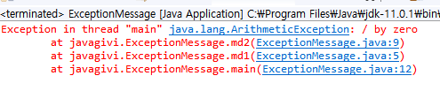

# 7. Java
**:book: Contents**

* [Java I/O Stream](#Java-TryCatch)

---

### Java TryCatch
* **오류와 예외의 차이**

  - 오류란 프로그래밍 언어의 문법적 실수를 뜻하고 컴파일 과정에서 그 잘못을 발견할 수 있다. 그러나 예외는 프로그램이 실행 중에 발생하는 정상적이지 않는 상황을 의미한다.

  - 자바는 예외 상황별로 그 상황을 알리기 위한 클래스를 정의하고 있다. 이러한 클래스를 예외 클래스라한다. 가상머신은 에러 상황이 발생하면 예외 클래스 인스턴스를 생성한다. 그리고 이 인스턴스를 프로그래머가 처리하면 예외는 처리된 것으로 간주하고 프로그램을 종료한다. 그러나 이러한 처리 절차를 처리하지 않는다면 프로그램은 종료가 된다.

- **Try-catch**(Java의 예외처리)

  ```java
  try{
      ...관찰 영역...
  }catch(Exception name){
      ...처리 영역...
  }finally{
      //코드의 실행이 try 안으로 진입하면, 무조건 실행된다.
  }
  ```

  - 예외 클래스의 최상의 클래스는 `java.lang.Throwable` 이다.

  - finally안에 try ...catch구문이 존재할 수 있다.

    

- **예외처리의 책임 전가**

  ```java
  public class ExceptionMessage {
  	public static void md1(int n) {
  		md2(n,0);
  	}
  	
  	public static void md2(int n1, int n2) {
  		int r = n1/n2;
  	}
  	public static void main(String[] args) {
  		md1(3);
  		System.out.println("exit");
  		
  	}
  
  }
  /*
  md2 메소드에서 exception발생 그러나 처리로직 없음 md1에 전가
  md1 메소드에서 exception발생 그러나 처리로직 없음 main에 전가
  main 메소드 처리로직 없음
  프로그램 종료
  */
  
  
  
  ```

  

- **예외 클래스 구분**

  <Error클래스>

  - Error클래스를 상속하는 예외클래스는 try-catch로 처리 대상이 되지 않고 그냥 프로그램이 종료된다.

  - 대표적으로

    - IOError:입출력 관련해서 코드 수준 복구가 불가능한 오류 발생

    - VirtualMachineError:가상머신에 심각한 오류발생

      

  <RunTimeException클래스>

  - 대개 프로그램의 실수로 발생하는 예외

  - Try-catch로 처리하기 보다는 코드레벨에서 잘못된 부분 수정

    - 배열 생성시 길이를 음수로 지정(NegativeArraySizeException)
    - 배열에 적절치 않는 인스턴스를 저장하는 예외(ArrayStoreException)
    - NullPointerException

  - RunTimeException을 상속하는 클래스는 예외는 선택(Try-catch처리 선택)

    

  <RunTimeException을 제외한 Exception 클래스>

  - 주로 Try-catch로 처리되는 예외

  - 반드시 Try-catch처리

    

    

  

  

  cf)

  - throws 키워드는 해당 메소를 호출한 메소드에 넘김
  - main 메소드가 throws하면 가상머신으로 넘어간다.
  - throws 키워드는 둘 이상의 예외에 대한 처리를 넘길 수 있음
  - throw는 예외를 발생시키는 키워드 이다.

  


- **프로그래머가 정의하는 Exception**

  ```java
  import java.util.Scanner;
  class ReadAgeException extends Exception {//프로그래머가 정의하는 Exception
  	public ReadAgeException() {
  		super("유효하지 않은 나이가 입력되었습니다.");//
  	}
  }
  
  class MyExceptionClass{
  	public static void main(String[] args) {
  		System.out.println("나이 입력: ");
  		try {
  			int age = readAge();
  			System.out.printf("입력된 나이: %d \n",age);
  		} catch (ReadAgeException e) {
  			// TODO Auto-generated catch block
  			System.out.println(e.getMessage());//"유효하지 않는 나이가 입력되었습니다"
  		}
  	}
  	
  	public static int readAge() throws ReadAgeException{
  		Scanner kb = new Scanner(System.in);
  		int age = kb.nextInt();
  		
  		if(age<0)
  			throw new ReadAgeException();
  		
  		return age;
  	}
  }
  
  ```

- **try-with-resources**

  - try,catch 구문에서 finally가 들어가면 가독성 측면에서 소스 코드가 복잡해진다.

    따라서 자바 7에서 try-with-resource문이라는 것이 추가되었다.(코드가 간결해짐)

  - try-with-resource에서 catch는 선택

    ```java
    try(resource1;resource2){ //둘 이상의 resource는 ;로 구분
      //resource는 내가 생성하려는 resource(파일 등)고 try-with-resources문을 나가면 자동제거
        ...
    }catch(Exception name){
        ...
    }
    ```

  - ```java
    
    class MyExceptionClass{
    	public static void main(String[] args) {
    		Path file = Paths.get("경로");
    		try(BufferedWriter writer = Files.newBufferedWriter(file)){
    			writer.write('A');
    			
    		}catch(IOException e) {
    			e.printStackTrace();
    		}
    	}
    }
     
    ```

  - `java.lang.AutoCloseable` 인터페이스는 자동으로 종료되어야 할 리소스 관련 클래스를 반드시 구현해야 하는 인터페이스 이다. BufferedWriter 클래스도 이 인터페이스를 구현하고 있다.

    - try-with-resources문에서 호출하는 메소드는 AutoClosesable 인터페이스의 close 메소드이다. 따라서 close 이외의 메소드 호출을 기대하기 어렵다.

- **예외처리와 성능**

  - try 구문 안에 위치한 코드는 try 구문 밖에 위치한 코드에 비해 실행 속도가 느리다. 따라서 과도한 예외처리는 심각한 성능저하로 이어질 수 있다. 따라서, 예외처리가 불필요한 코드를 try구문 안에 두는 일은 자제해야한다.


> :arrow_double_up:[Top](#7-java)    :leftwards_arrow_with_hook:[Back](https://github.com/HanHoJung/Java) 

---

## Reference

<http://www.cs.sfu.ca/~tamaras/exceptions/Throwable_Class.html>


